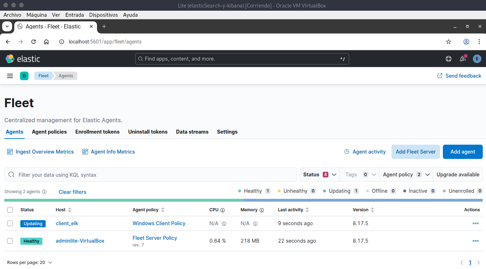
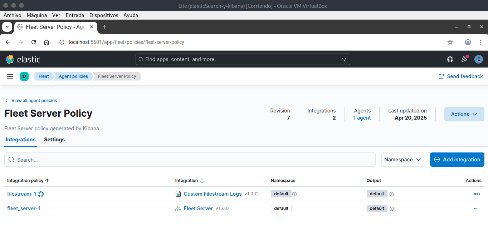

# Fleet y Elastic Agent
## Información Elastic Agent
Los **Elastic Agents** son agentes ligeros en el **Stack de Elastic** que sustituyen a los **Beats**.

:::info[Funciones principales]
- **Recolectar datos** *(logs, métricas, eventos de seguridad)*.
- **Enviarlos a ElasticSearch/Kibana**
- **Ejecutar integraciones preconfiguradas**
:::

## Información Fleet
Es una **herramienta centralizada** de *Kibana* para gestionar agentes *(Elastic Agents)* que recolectan datos.

:::info[Funciones]
- Administrar múltiples agentes de forma centralizada.
- Establecer las políticas de recolección de datos.
- Monitorización del estado de los agentes.
:::

### Estructura a lograr
Para el correcto funcionamiento de **Fleet** se requiere lograr una estructura funcional que es la siguiente:
- **Host**: *es el **host** donde se crea el elastic agent.*
- **Agent Policy**: requiere de **flet server policy**
- **Integrations**: aquí se añaden las integraciones necesarias para la obtención de datos, es importante que exista la **Fleet Server** para lograr la funcionalidad de una administración centralizada de los agentes.


## Aplicaciones prácicas
<details>
<summary>
Listado de aplicaciones prácticas posibles
</summary>

- **Agentes instalados en servidores que envian métricas del sistema**: *RAM, uso de la CPU*.
- Uso de **dahsboards** para ver esos datos.
- **Centralización** de los **logs** al ser indexados en elasticsearch.
- Permite **múltiples integraciones**.

</details>


## Configuración e instalación
Una vez se tiene instalados tanto **ElasticSearch** como **Kibana** se procede a configurar un **Elastic agent** en **Fleet**. 

:::info[Acceso Kibana]
- http://localhost:5601
:::

Por ello, hace falta **loguearse** en **Kibana** y acceder a la siguiente ruta a través del menú lateral accesible a través del icono hamburguesa.
```
Management > Fleet
```

### Add a Fleet Server
Una vez aquí se procede a **Add a Fleet Server** y para ello se usa la opción **Quick Start** creando una política nueva donde se han de especificar varios datos.

:::tip[Datos necesarios para la política]
- Nombre del host
- URL + Puerto (8220)
:::

Una vez creada la política esta será accesible desde la siguiente URL.
```bash
https://localhost:8220
```

:::warning[Ojo al protocolo]
El protocolo web al específicar la máquina con el puerto ha de ser **HTTPS**.
:::

Siempre que esté instalado en la misma máquina que **Fleet**, sino habría que poner la **IP** de la máquina donde esta instalado **Fleet**.

Una vez introducidos los datos se pulsa el botón de **Generate** y se obtendrá un **Token** y mostrará la configuración del Host y la ruta de acceso, que será la específicada anteriormente. Además se informa de que se podrán realizar ajustes en **Fleet Settings**.

## Instalación para la administración centralizada
Se recomienda instalar *Fleet Server* para **centralizar la administración** de los agentes, para ello procedemos a descargar el agente desde la shell mediante **CURL** apuntando a la **URL** *artifacts.elastic.con/downloads/beats/elastic-agent* y una vez obtenido el tarball se ejecutan los siguientes comandos que comprenden la instalación del mismo a través del correspondiente **script** y con varios **argumentos** como *la IP:puerto, el token o la política asignada*.

Una vez se han llevado todos estos pasos la shell pedirá la contraseña de **root** o del usuario con privilegios elevados para poder **instalar** el *agente* de **forma local** en la siguiente ruta.
```bash 
cd /opt/Elastic/Agent
```
Una vez finalizada la instalación se recibe un mensaje del estado del proceso.
```bash
Elastic Agent has been succesfully installed.
```

### Posibles problemas
A veces el proceso no va tan automático y se queda con la obtención del tarball
```bash
tar -xzf elastic-agent-8.13.4-linux-x86_64.tar.gz
```
Entonces se descomprime y se accede a el directorio obtenido para ejecutar la instalación
```bash
sudo ./elastic-agent install \
  --url=https://<IP>:8220 \
  --enrollment-token=TOKEN_OBTENIDO_CON_KIBANA
```
#### Consulta de logs
```bash
sudo journalctl -u elastic-agent -f
```

## Acceso al agente instalado


Una vez se ha instalado el agente de forma satisfactoría se puede acceder a el en la sección **Fleet > Agents**.
<details>
<summary>
Información relevante sobre el agente
</summary>

- **Status**: Healthy, Unhealthy, Updating, Offline, Inactive o Unenrolled.
- **Host**
- **Política del Agente**
- **Uso de CPU**
- **Uso de Memoría**
- **Última actividad**
- **Versión**

</details>


## Integraciones


Una vez establecida correctamente la instalación y configuración del agente, en la sección **Fleet** de **Kibana** se puede comprobar el **host** y su correspondiente **status** *(Healthy es el estado deseable)*.

En este caso se procede a las integraciones, por defecto es necesario tener la integración de **Fleet Server** y luego ya el resto de integraciones van en consonancia con la funcionalidad requerida y el objetivo trazado. Existen integraciones para Suricata, Nginx, MySQL, AWS, Azure, etc...

## Comandos información elastic-agent
<details>
<summary>
Listado de comandos 
</summary>

- **install/uninstall**
- **status**: estado del agente.
- **upgrade**: actualización del agente.
```
sudo elastic-agent upgrade <versión>
```
- **inspect**: verifica la conexión
- **diagnostics collect**: genera un diagnóstico con almacenamiento de datos.

</details>


## Windows
<details>
<summary>
Comandos útiles en <b>PowerShell</b> para obtener información del <b>agente elástico</b>.
</summary>

- Get-Service ElasticAgent
- Restart-Service ElasticAgent
- Stop-Service ElasticAgent
- Remove-Item -Recurse -Force
- Get-Help
- Get-Process | Where-Object {}
- Consultar la consola de servicios: services.msc
- sc stop ElasticAgent
- sc 

</details>


## Resumen
<details>
<summary>
Pasos del procedimiento de instalación
</summary>

### Instalar Elastic
1. **GPG** de **elastic.co**
2. Añadir el repositorio
3. Instalar **JDK** de Java
4. Instalar **elasticsearch** *(conservar la contraseña generada)*

### Instalar Kibana
5. Instalar Kibana
6. Generar **token enrollment** de elastic para configurar Kibana
7. Loguearse *(a veces pide un código además del token)*

### Fleet Server
8. Añadir un **Fleet Server** *(policy y token de 1 solo uso)* en modo **standalone** al **Fleet**.
9. Especificar la **URL** en su configuración como **HTTPS** y haciendo uso del puerto **8220**.
10. Descargar el agente elastico vinculado al **Fleet Server** con **curl** y luego proceder a su instalación en la máquina que hace de **master**.
:::warning
Usar el argumento **--insecure** con el agente elástico durante su instalación si no se ha incorporado un certificado **SSL**.
:::
11. En **master** se puede dejar **localhost**, pero para los clientes mejor realizar un direccionamiento en el fichero de **host** a un nombre de **dominio local**.

## Cliente
1. Añadir un agente elástico
2. Crear una política
3. Añadir integraciones
4. Descargar un agente elástico
5. Instalar: sin **localhost** con la combinación de **--insecure**.

</details>
