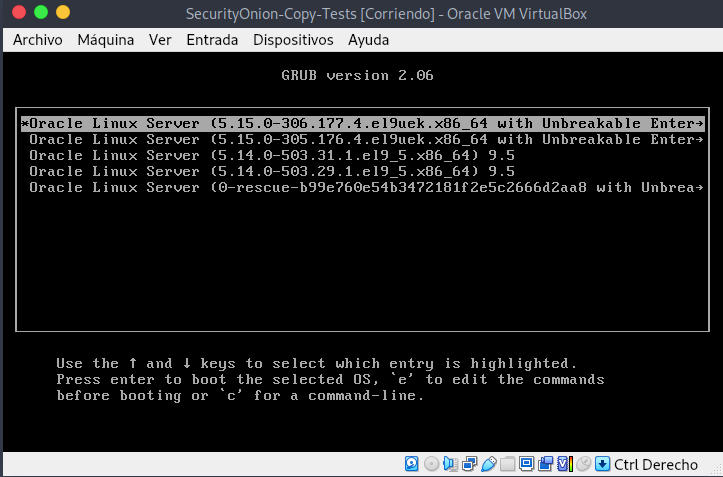
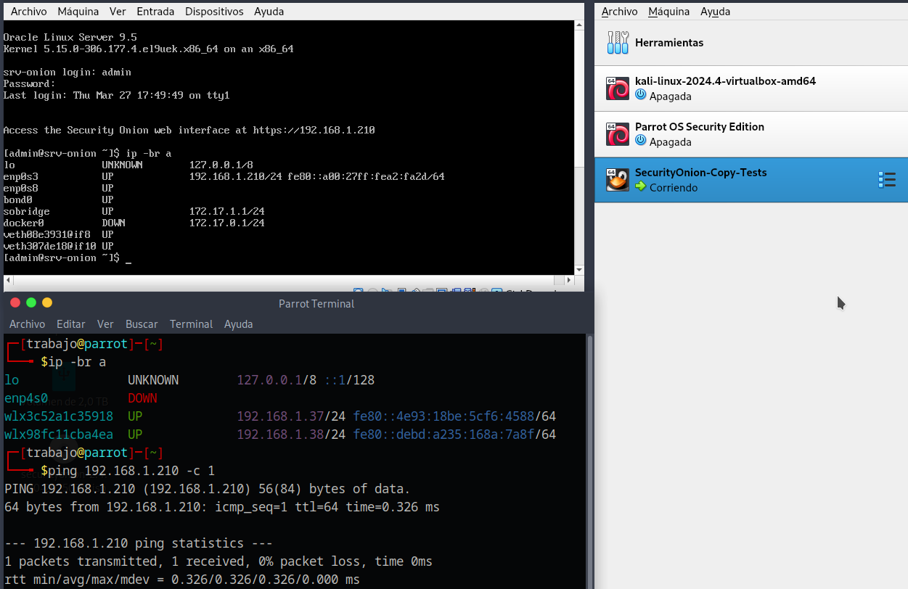
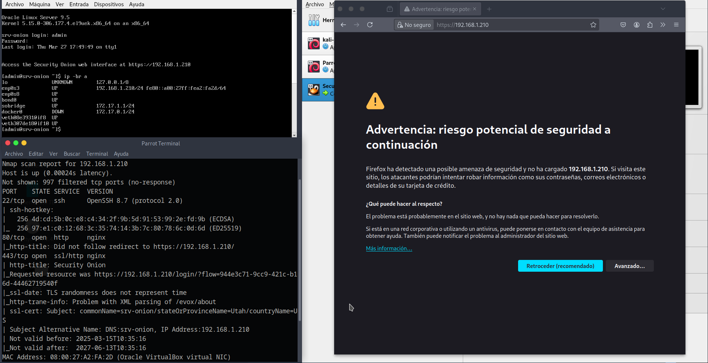
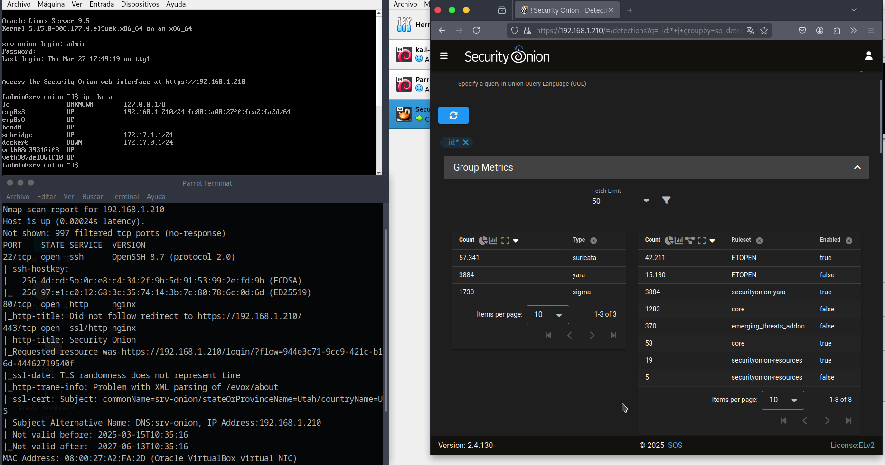
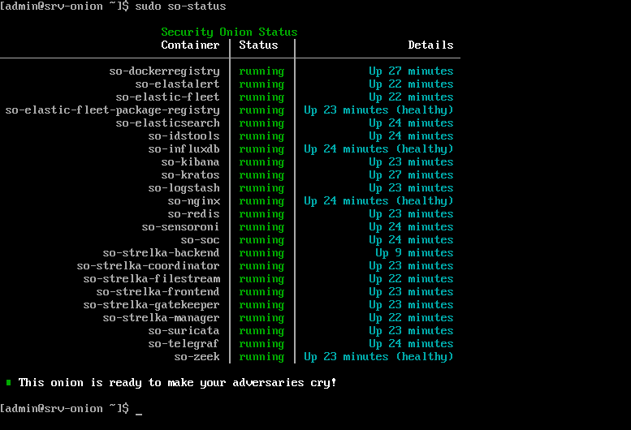

# Inicialización y Arranque
El **Grub** del arranque de **Security Onion** posibilita iniciarlizar **Security Onion**.

Una vez finaliza el arranque del sistema se realiza login para y el **OS** muestra la **IP** de administración para acceso web.

A continuación, se abre el **navegador web** de la *máquina cliente*, máquina que está en la misma red que el **Security Onion** para poder acceder a la interfaz de administración.

En el primer aviso se mostrará **advertencia de seguridad**, se acepta el aviso y se accede a la interfaz de gestión.

Realización de la comprobación del estado de los contenedores que alojan los servicios en ejecución.

