# Instalación de SO
Dentro del amplio conjunto de instalaciones que ofrece **Security Onion** abarcando un número amplio de posibilidades y escenarios se recomienda para un entorno de producción la instalación **Standalone**, que por otra parte es la que tiene mayor demanda de recursos.

:::tip[Versión de desarrollo]
- Repositorio de Security Onion: <a href="https://github.com/facebook/docusaurus">GitHub</a>
:::

## Opciones de instalación
Existen varias opciones de instalación como ya se vió en la entrada de **pasos previos**, entre ellas destacan las siguientes.

## Menú inicial
Desde este menú de arranque de la distribución se pueden escoger las diferentes instalaciones a realizar en función de la funcionalidad necesaria de implementar.

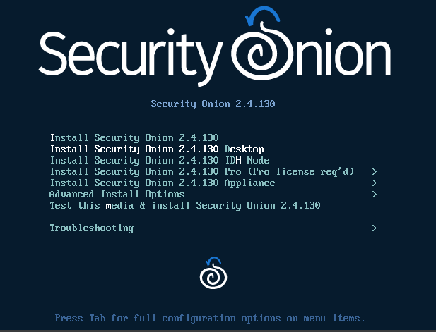

### Versión PRO
La versión **PRO** ofrece unas ventajas añadidas a tener en cuenta en función de las necesidades requeridas por la infraestructura donde se va a implementar el **Centro de operaciones de Seguridad"**.

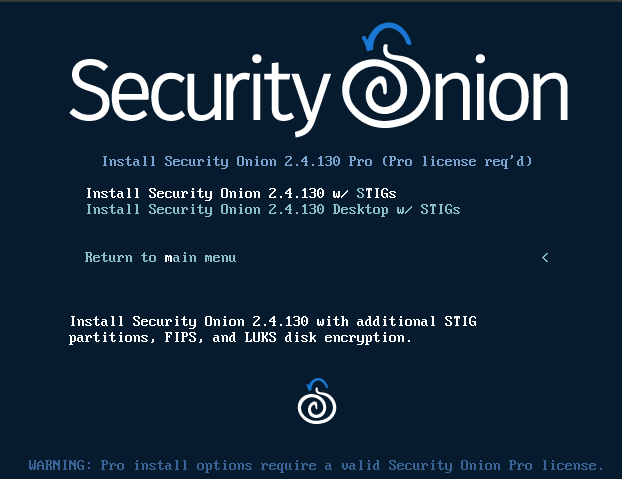

Listado de las principales mejoras de la versión <b>PRO</b>

- Habilitar **notificaciones salientes**: *utilización de emails, mensajes slack u otros sistemas*.

- Poder utilizar la **Security Onion Console* a través de OpenId, permitiendo la conexión con sistemas de *Active Directory, usuario de GitHub, Google o Auth0*.

- **Cumplimiento de DOD** *(STIG)*, que son las normas de Defensa de USA. 

- Cifrado **AES 256** *(Luks)* de almacenamiento.

- Servicio **SLA** prioritario.

### Opciones Avanzadas
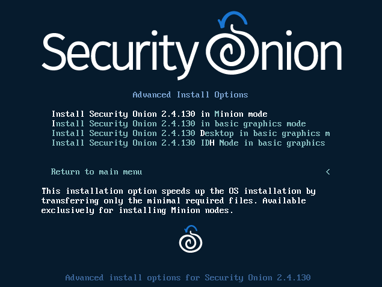

### Opciones Manager y SearchMode
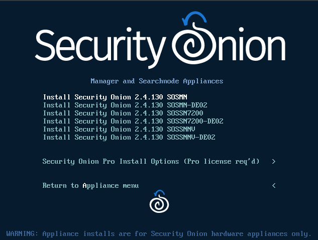

## Procedimiento de la instalación
Una vez escogida la opción de **Instalación** deseada se pide confirmación para llevar a cabo la instalación y utilizar el 100% del espacio del disco duro. El proceso de instalación en la versión **Standalone** y **Eval** es el mismo. 

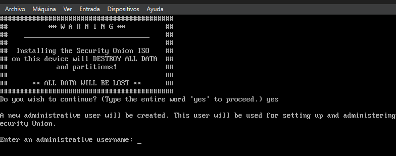

A continuación, el sistema **solicita** unas **credenciales**, dándo de alta un usuario principal. Solo hay que introducir un nombre de usuario y una contraseña *(más la confirmación de esta)*.

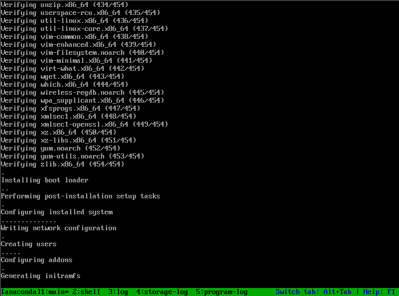

Entonces se carga automáticamente la interfaz para llevar a cabo el **setup** donde en una sucesión de pantallas se va a realizar la introducción de los siguientes datos.

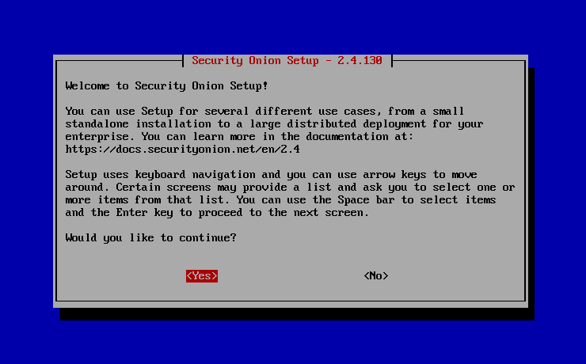

Escoger **configurar la red** y no comenzar directamente con la instalación del sistema **SOC**. 

:::note
No obstante si se escoge directamente la opción instalación la configuración de red se configurará más adelante, durante el propio proceso de instalación.
:::

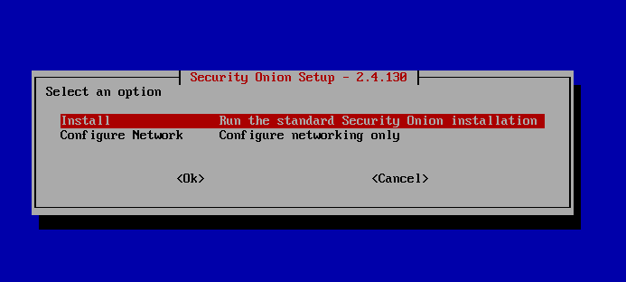

1. Establecer un **nombre** para el **Servidor**

2. Escoger una interfaz que será la encargada de las labores de gestión y administración.

3. Asignar si la configuración de red dependerá de un servidor **DHCP** o será **estática**.

4. En la opción estática se pide la introducción de una **dirección IP** en formato **CIDR** *(no olvidar la máscara)*.

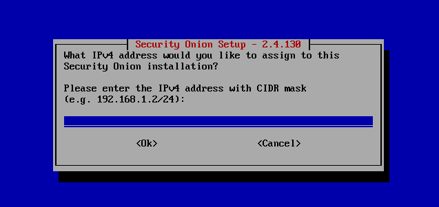

5. A continuación se pide introducir la dirección IP del Gateway.

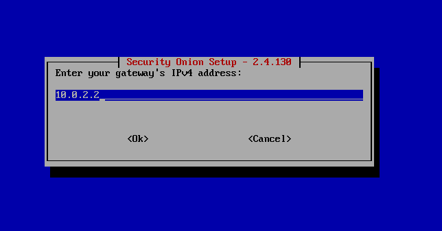

6. Se configuran las **DNS**, en caso de pruebas o en proceso de desarrollo se pueden usar las de **Google**.

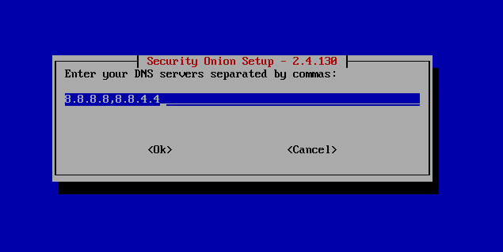

:::tip[DNS de Google]
- 8.8.8.8
- 8.8.4.4
:::

7. Introducción del nombre del **DNS** de búsqueda.

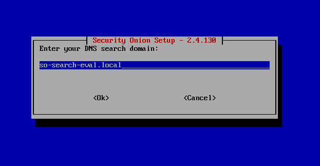

En esta momento se lanza un **mensaje de éxito** de la configuración y se sale del asistente. Aquí hay varias formas de proceder para volver al asistente.

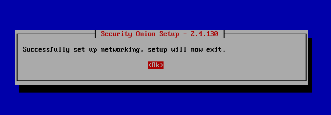

- **Hacer Log out**: y volver a hacer **log in**, lo cual lanza de nuevo el proceso de instalación.

- **Lanzar el script manualmente**: navegar hacía el directorio home del admin y en el directorio **"/SecurityOnion"** se encuentra el script **so-setup-network**.

Pero antes de volver al proceso de instalación se recomienda comprobar la configuración correcta de la interfaz.

:::tip[Comprobar interfaz]
- Ejecutar el comando **ip** con los parámetros **-br** y **a**
:::

Una vez se comprueba que la interfaz de gestión está correctamente configurada se procede a continuar con la instalación.

8. Se vuelve a **inicializar** la *sesión* con las **credenciales** de login.

9. Se escoge la versión de **Security Onion** a instalar, dado que este proceso descrito se ajusta a **Standalone** y **Eval** se recomienda escoger una de estas dos.

10. Se muestra por pantalla la **aceptación de la licencia**, hay que escribir *"agree"*.

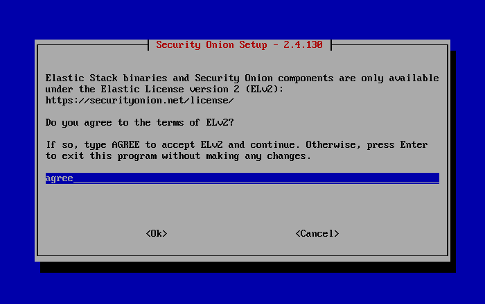

11. Se ha de escoger entra la opción de instalación **Standard** *(con acceso a internet)* y **Airgap** *(sin acceso a internet)*.

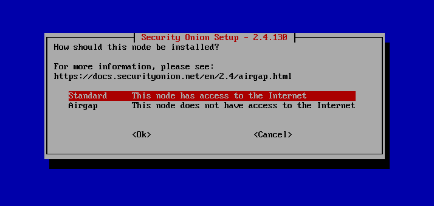

:::warning[Conexión a red]
Si la conexión es buena se puede proceder a realizar la instalación **Standard** no obstante si se escoge **Airgap** la instalación quedaría completamente funcional simplemente usando el contenido de la **ISO**. 
:::

11. Se pregunta si se quiere reconfigurar la interfaz de red, en este caso se selecciona **no**.

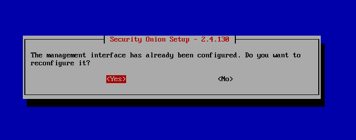

12. Se establece si la conexión se realizará de forma **directa** o a través de un **proxy**.

13. Se procede a crear una cuenta de acceso para la **interfaz gráfica** accesible mediante la barra del navegador web para realizar la administración del grid. Se ha de **introducir** una **dirección de email**. Esta dirección de email *no tiene porque ser real*, solo se usa para establecer un usuario para realizar el login.

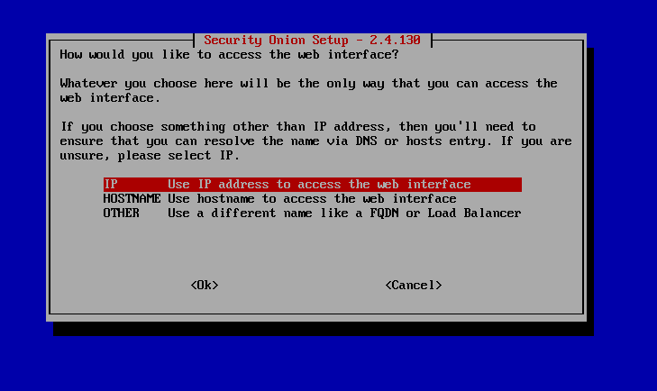

:::tip[Obtener la @]
- El teclado en este punto está en Inglés y no en Español, el simbolo de la **@** se puede obtener con la tecla **shift** en vez de con **alt gr**.
:::

14. Asignar una contraseña a la cuenta creada para acceder a la interfaz web, ha de tener **8 caracteres mínimo**.

15. Establecer el modo de acceso a la interfaz gráfica web, que pude ser mediante **IP**, mediante nombre de **host** u otra.

16. Permitir el acceso via web a la interfaz de **Security Onion**.

17. Escoger **rango de IPs** con formato **CIDR**, aquí colocar la dirección de red con máscara. 

18. Pide confirmación para activar la **telemetría** para el equipo de desarrollo de **Security Onion**.

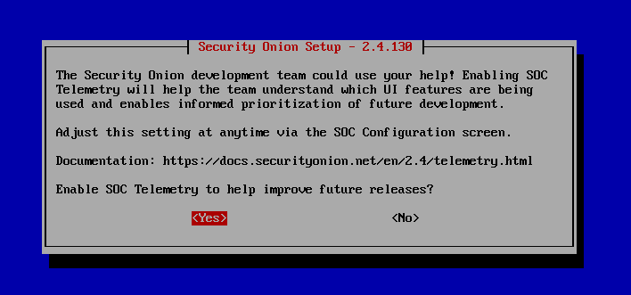

19. Muestra un **resumen final** de la instalación.

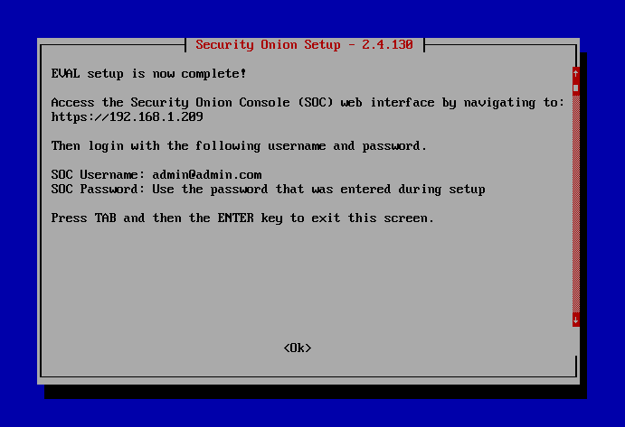

20. A continuación se lleva a cabo la **instalación**, que en *función del hardware*, del *modo escogido* o de la *necesidad de contar con internet* puede oscilar bastante.

:::note[Finalización de la instalación]
21. En este momento la instalación pasa a realizarse, completamente desatendida hasta su finalización. El tiempo esperado puedes oscilar entre 30 minutos a un par de horas, en función de modalidad escogida, conexión a internet y hardware del host.
:::

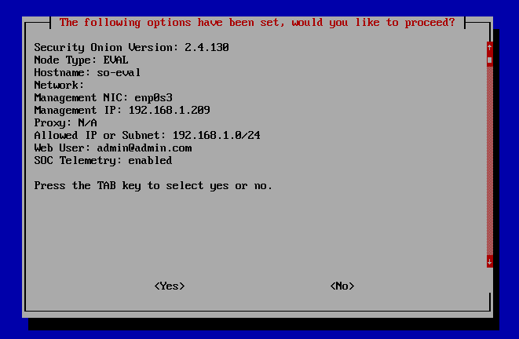

22. Una vez finalizada la instalación se muestra una ventana con el resultado de la misma. Una vez salido *(dando al OK)*, se sale de la instalación y se queda pendiente de loguearse en la terminal.

Resumen de los pasos seguidos durante el procedamiento.

- **IP** para Security Onion, introducir con formato **CIDR** *(introducir máscara)*
- **IP** del **Gateway** en formato **IPv4**.
- Configurar **DNS**, si no se dispone de propias se usan las de algún proveedor como las de **Google**.
- Introducir **dominio** de búsqueda **DNS**.
- Escoger **versión** de la **instalación** a realizar.
- Aceptar la **licencia**.
- Instalar desde la **ISO** o desde **Internet**.
- Establecer **cuenta** y **contraseña** de acceso.
- Establecer por medio de **IP** o **Hostname**.
- Aceptar/Denegar la **telemetría**.

