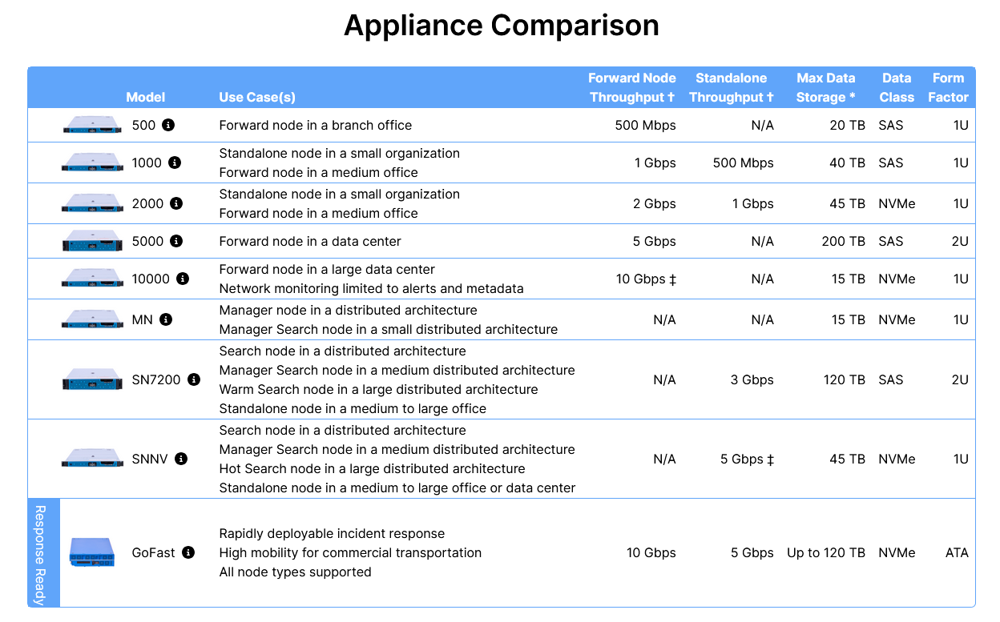

# Versión profesional de SO

La versión **profesional** de **Security Onion** cuenta con las siguientes características extras.

- **OpenID Connect (OIDC)**: *Autenticación de sesión a través de OpenID a uno de los varios proveedores compatibles con OIDC, como pueden ser Active Directory o Azure AD, GitHub, Google o Auth0, entre otros.*

:::tip[Soporte técnico oficial]
Esta integración puede ser compleja y para ello existe la posibilidad de recibir el apoyo del soporte oficial.
:::

- **Cifrado de discos LUKS** *(Linux Unified Setup)*: *Es la encriptación más común de cifrado de datos en sistemas **GNU/Linux**. Ofrece la posibilidad de utilizar la mayoría de algoritmos de cifrado (AES, Serpent, Twofis), modos de cifrado (ECB, CBC, XTS) y funciones hash (SHA-1, SHA-256, SHA-512, RIPEMD160, etc.). Permite el cifrado incluso de la partción **SWAP**.*

- **Cumplimiento de FIPS OS**: *Cubre los estándares federales para el procesamiento de información*.

:::tip[+ Información]
- <a href="https://public.cyber.mil/stigs/">Website de Stigs</a>
:::

- **Cumplimiento de STIG OS**: *Implementa el seguimiento de las guías de seguridad para establecer una implementación acorde a los requisitos del **Departamento de Defensa** (DoD), acorde al mandato **DODI 8500.01.** * 

- **Notificaciones y seguimientos dentro de cases**: *El módulo **Detections** de SO, y las reglas de **Sigma**, pueden habilitarse para enviar notificaciones de salida al crear alertas. Así cualquier alerta del **Grid** es posible notificarla. Las notificaciónes pueden ser a través de **SMTP** *(email)*, de **Jira** o de **Slack** *(programa de mensajería instantáneo)*.

Estas notificaciones también se permite adecuarlas a diferentes niveles de severidad.

0. **Severidad desconocida**
1. **Severidad informativa**
2. **Baja gravedad**
3. **Severidad media**
4. **Alta Severidad**
5. **Severidad crítica**

- **Security Onion Connect API**: 

:::tip[Ejemplo de implementación de la API]
- <a href="https://blog.securityonion.net/2025/02/external-api-for-security-onion-pro.html">Ejemplo</a>
:::

- **Active Consulta Management**: *Proporciona apoyo profesional y horas de soporte técnico mediante teléfono, email o escritorio remoto. Además, de un estudio de la infraestructura 2 veces al año.*

## HW dedicado

Security Onion dispone de una gama variada de opciones para la adquisición de servidores propios. Los modelos aquí listados coinciden con las **appliances** disponibles desde el menú de instalación del sistema operativo.

