# UI Web de Security Onión :globe_with_meridians:
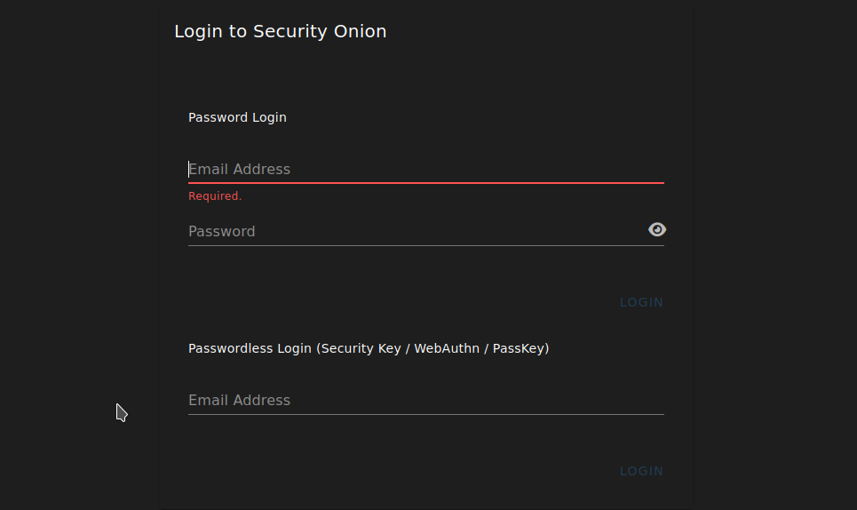
La interfaz de usuario Web *(Web UI)* es la **herramienta de administración** y centralización del SOC, como curiosidad esta interfaz recibe el mismo nombre que la funcionalidad principal de Security Onion, es decir **SOC**, es importante saberlo porque puede resultar confuso inicialmente al buscar información o leer la documentación, en este caso el nombre de la interfaz significa **Security Onion Console**.

## Alerts :warning:
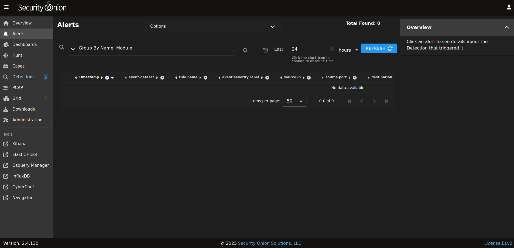
Security Onion incorporta un interfaz que ofrece una visión general de las alertas que el sistema está generando. Una vez profundizado en estas alertas se puede acceder a otras herramientas como **Hunt**, **PCAP** o **Cases** para aumentar la información sobre la misma.

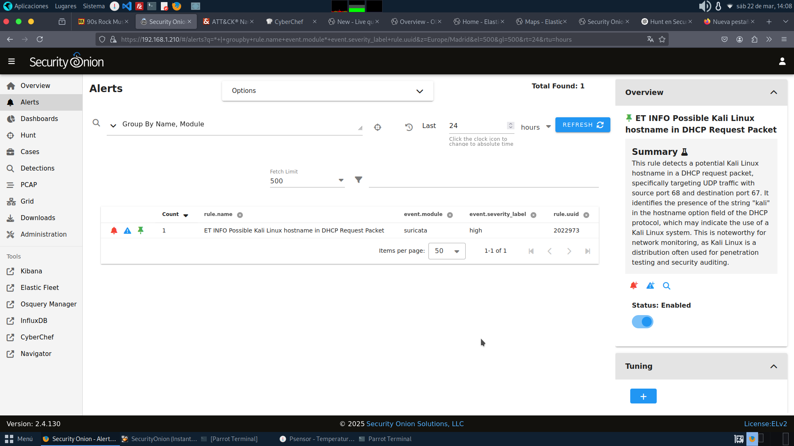

En la parte superior se ofrece un desplegable con una lista de **opciones** para estructurar las alertas.

### Toggle :black_nib:
Permite disponer de opciones más avanzadas en el etiquetado de las alertas.
- **Acknowledged**: mostrará alertas previamente reconocidas por un analista.
- **Escalated**: mostrará alertas que previamente han sido escaladas por un analista.
- **Show Details Panel**: mostrará más detalles en el panel lateral de la derecha.
- **Aplicar** automáticamente **filtros**.
- **Activar opciones avanzadas** de la interfaz.
- **Activar refrescos automáticos** de **alerts** y ajustar el intervalo.

:::warning[Opciones]
Hay que tener cuidado con las opciones marcadas, porque si se marcan todas no se muestra la misma información que si se selecciona solo algunas. Sobretodo ser consciente de esto si se activa la opción **Escalated**.
:::

## Dashboards :pager:
Conjunto de paneles preconstruido que permite el análisis de datos estándar.

En la parte superior también tiene un **Toggle** para escoger una serie de opciones que permiten ajustar los diferentes paneles:
- **Auto**: activada por defecto y presenta automáticamente la consulta cada vez que cambie los filtros, grupos o rangos de fechas.
- **Exclude case data**: paa excluir los casos de uso *"por defecto"* y así poder consultar los datos de los casos propios.
- **Exclude detections data**: para excluir los datos de detección *"por defecto"* y así poder consultar los propios datos de detección.
- **Exclude SOC Logs**: para excluir los registros de diagnósticos SOC *"por defecto"*
- **Automatic Refresh Interval**: ajustar el tiempo de refresco al intervalo requerido.
- **Time Zone**: Ajustar los paneles a un determinado uso horario.

### Marco de tiempo :hourglass_flowing_sand:
Por defecto se busca en las últimas 24 horas pero se puede ajustar el marco de tiempo a las necesidades requeridas.

### Métricas :alarm_clock:
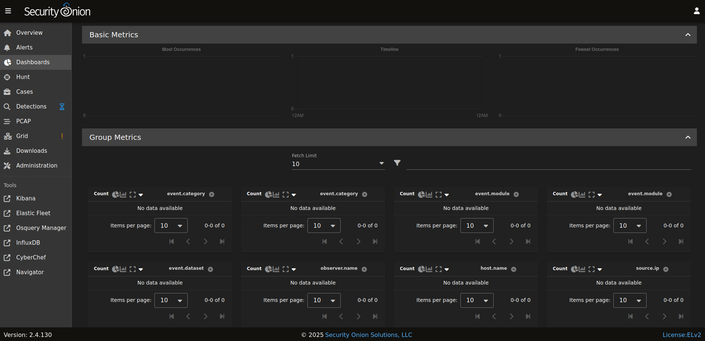
El dashboard muestra una serie de métricas:
- **Métricas básicas**: contiene la visualización de la mayoría de los acontecimientos.
- **Métricas de grupo**: contiene tablas y visualizaciones que permiten aplicar campos arbitrarios generando agregados. Estas métricas están controladas por **groupby**. Al hacer click sobre un determinado valor se despliega un menún contextual que permite una serie de acciones para mejorar la búsqueda, incluso permite la salida hacía sitios externos como **Google** o **VirusTotal**. Se permite configurar, como en otras partes del **SOC** el *Rows per page*.
- **Eventos**: Se muestra una tabla de datos donde se pueden consultar los resultados de búsqueda y permite profundizar en los resultados individuales.

Existe una **flecha** en el lateral izquierdo de cada registro que permite profundizar en **más detalles** sobre el evento.

<details>
<summary>
Listado de loss atributos de cada registro en la tabla (encabezados).
</summary>

- **Timestamp**
- **event.dataset**
- **rule.name**
- **event.severity_label**
- **event_data.event.dataset**
- **event_data.source.ip**
- **event_data.source.port**
- **event_data.destination.host**
- **event_data.destination.port**
- **event_data.process.executable**
- **event_data.process.pid**

</details>

## Hunt  :gun:
Se trata de una interfaz similar al **Dashboard** pero más centrada en la **caza de amenazas**. Entre las principales diferencias con **Dashsboard** están las siguientes:

- Las consultas de **Hunt** están más enfocadas.
- Las consultas predeterminadas suelen presentar múltiples campos agregados en una sola tabla, lo que depende del tipo de evento puede resultar mucho más beneficioso.

A parte de estas dos diferencias, tanto **Hunt** como **Dashboards** son bastante similares.

## Cases :open_file_folder:
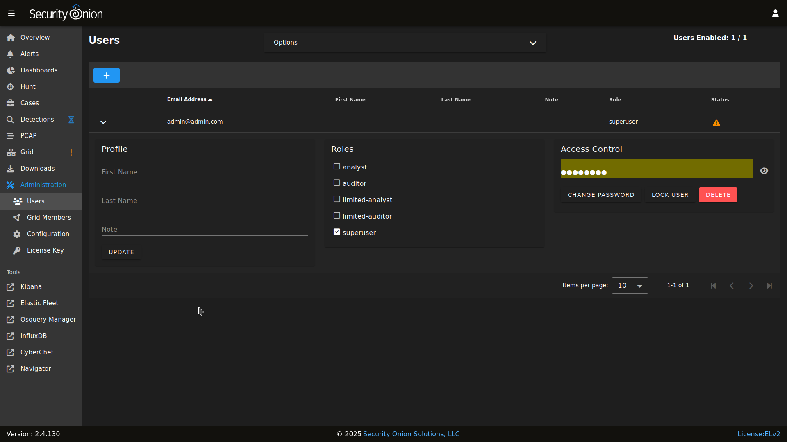
Se trata de la interfaz del SOC de Security Onion para la **gestión** de **casos**, que permite escalar los registros de **Alerts, Dashboards** y **Hunt**, para luego llevar a cabo diferentes acciones como: asignar analistas, añadir comentarios, añadir archivos adjuntos y rastrear observables.

Los **analistas** son cualquier persona o equipo de personas asignadas a gestionar algún caso o evento.

Los **observables** son **pistas** que están alojadas en los datos para de esta forma detectar anomalías o amenazas. Ejemplos de observables son:

- **Direcciones IP**: origen o destino del tráfico sospechoso.
- **Hashes de archivos**: permiten la identificación de malware.
- **URLs o dominios**: permite identificar fuentes de phising u otro tipo de actividad maliciosa.
- **Direcciones de correo electrónico**: sospechosas de ser usadas para llevar a cabo actividades maliciosas.
- **Indicadores de ataque (IoA)**: sirven para analizar la intención y el comportamiento del atacante.
- **Indicadores de compromiso (IoC)**: proporcionan evidencias forenses de que un ataque ya se produjo o está actualmente en curso.


En la parte superior también existe un **Toggle** para escoger una opción o varias opciones de un listado.

### Creación de un nuevo caso :clipboard:
Para crear un nuevo caso se ha de hacer click sobre el icono de sumar **"*"** y se desplegará una ventana modal donde se pueden llevar a cabo diferentes acciones:

- **Añadir comentarios**.
- **Añadir adjuntos**.
- **Añadir observables**.
- **Añadir eventos**.
- **Comprobar el historial de casos**.

## Detections :fire:
Se trata de una interfaz para gestionar todas las reglas de detección, estas reglas pueden ser:

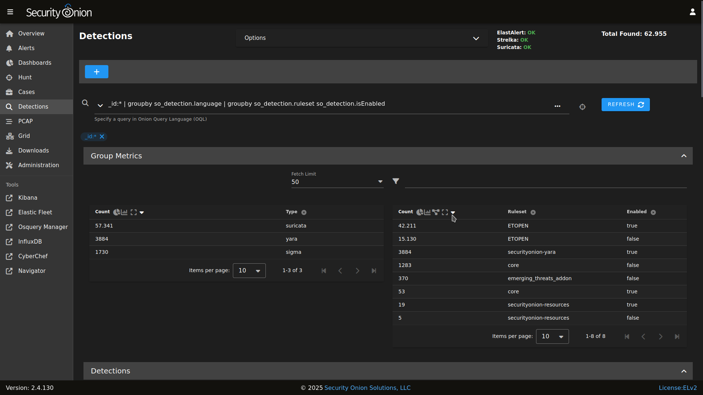

- Reglas **NIDS** que se cargan en **Suricata**.
- Reglas de **Sigma** que se cargan en **ElastAlert 2**.
- Reglas de **Yara** que se cargan en **Strelka**.

:::tip[Aclaración de conceptos]
- **NIDS**: es el *Network Intrusion Detection System* que sirve para monitorizar y analizar el tráfico, además de generar alertas y llevar un registro de eventos. **Ejemplo**: *Suricata*.

- **Sigma**: Estándar abierto para la generación de **reglas abiertas** para la **detección de patrones** de **amenazas** en los datos que se pueden implementar en plataformas de seguridad como los sistemas **SIEM** *(Security Information and event Management)*

- **ElastAlert**: sistema de **gestión de alertas** del stack de Elastic que permite generar alertas y **automatizar respuestas** automáticas mediante el uso de scripts de respuesta ante ciertas alertas.

- **Yara**: herramienta de análisis de **Malware** y detección de amenazas que permite establecer reglas para detección de patrones, strings, streams, estructuras o funciones dentro de archivos o procesos.

- **Strelka**: herramienta de **análisis de archivos** para analizar su contenido y **metadatos** para **encontrar** *indicadores de compromiso* *(IoC)*. Es realmente útil en entornos donde se procesa una cantidad alta de datos. Se integra muy bien con **ElasticSearch**.
:::

En la parte superior existe un **Toggle** desplegables que permite escoger entre un listado de opciones y en la parte derecha se puede comprobar el estado de los **3 servicios** principales de **alertas** que suministran la información a *Security Onion* que son:

- **ElastAlert**
- **Strelka**
- **Suricata**

A continuación, se encuentra una tabla con las principales métricas donde destaca el total con **Count** y el tipo con **Type**


:::tip[Video explicativo]
<a href="https://www.youtube.com/watch?v=DelAmqtU2hg&feature=youtu.be">Visualizar el contenido</a>
:::

## PCAP  :card_index:
Permite acceder a captura de paquetes que fuera escrita por **Suricata** o **Stenographer**. Permite añadir un **Job** a través del botón **"+"**, especificando un ID de Sensor, un ID para el Import, un protocolp, una IP de origen, un puerto de origen, una IP de destino, un puerto de destino y una ventana de tiempo.

:::tip[Stenographer]
- **Stenographer**: Una de las herramientas que utiliza **Security Onion** para escribir tráfico de red en disco. Permite realizar capturas completas de paquetes para detectar intrusiones y es independiente de **Suricata** y **Zeek** ya que utiliza **AF-PACKET** para la adquisición de paquetes. El uso de **AF-PACKET** es independiente de **Suricata** y **Zeek** con lo cual no tiene ningún tipo de impacto en las alertas **NIDS** *(Network Intrusion Detection System)*. **AF-PACKET** se utiliza para recoger el tráfico de las interfaces de red, esta integrado en el **Kernel** de GNU/Linux y permite actuar como balanceador de carga del flujo de datos.
- **GitHub**: <a href="https://github.com/google/stenographer"> Ir al repositorio</a>
:::

En instalaciones de **Security Onion**, tanto en eval como en standalone, la captura de paquetes completa está llevada a cabo por **Suricata**, en otro tipo de despliegues de **Secutity Onion** se realiza por **Stenographer**. Almacena los datos en **/nsm/pcap**.

:::tip[Zeek]
- **Zeek**: es un marco de análisis de red, sustituto de **Bro**, utiliza SID (identificador único) para asociar este ID a cada regla o firma, y estas conforman los patrones o criterios definidos por Zeek para identificar los eventos sospechosos en la red. Además utiliza scripts personalizados para analizar el comportamiento de la red.

- <a href="https://zeek.org/">Website</a>
:::

## Downloads :arrow_double_down:
Esta sección permite descargar **Elastic Agent** para diferentes sistemas operativos.

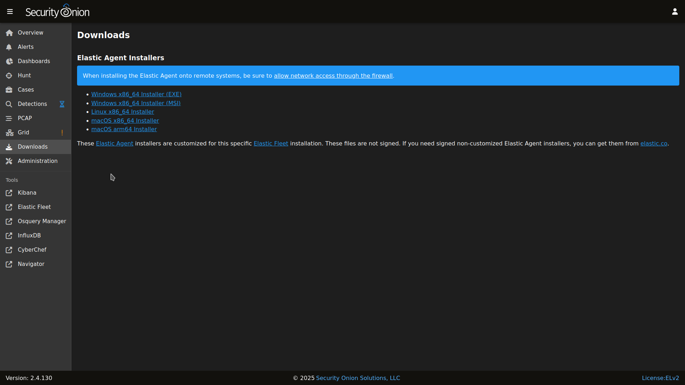

### Elastic Agent :oncoming_police_car:
Permite recopilar datos desde cualquier lugar como un solo agente unificado. Cada nodo de **Security Onion** utiliza **Elastic Agent** para transportar los datos a **Elastic Search**.

## Grid :gem:
Security Onion incluye una interfaz de **Grid** para poder conocer rápidamente el estado de todos los nodos de la red.

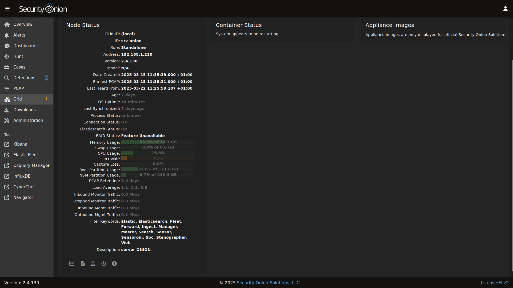

En la parte superior se puede encontrar la sección **Grind EPS** que muestra la suma de todos los **Consumption EPS**, que son las mediciones de toda el **Grind**. EPS representa el número de eventos por segundo consumidos, por lo que solo es importante en los nodos que **ingieren** datos.

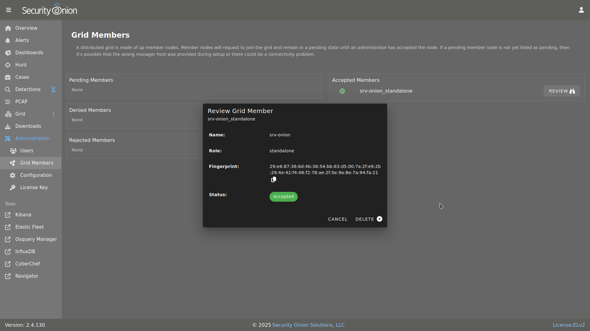

A continuación se encuntra la información de todos los nodos del **Grind**.
Los nodos nuevos pueden tardar unos minutos en inicializarse completamente y aparecer con el valor **Fault**.

## Administration 	:busts_in_silhouette:
Esta parte de la interfaz sirve para poder administrar usuarios, miembros del grid, realizar configuraciones y gestionar la licencia de Security Onion.

## Tools :nut_and_bolt:
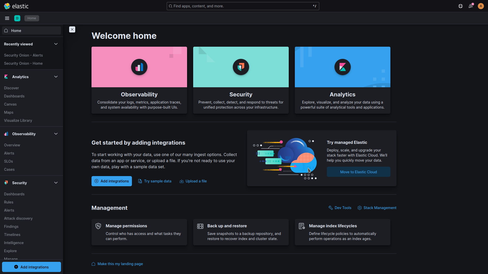
### Kibana :chart_with_downwards_trend:
Para utilizar Kibana hace falta realizar login dentro del acceso común de la pila del **Stack** de **Elastic**. Se hace login con las mismas credenciales utilizadas en **Security Onion**.

Para poder añadir nuevas cuentas para **Kibaba** estas han de llevarse a cabo a través del **SOC** sino no funcionarán, no se pueden crear directamente en **Kibana**. Es decir se deberían de crear usuarios nuevos en la subsección **users** de la sección **Administration**.

Los ajustes de configuración de **Kibana** suelen estar en la propia **Kibana** no obstante a veces hay algún ajuste que hay que realizar en la subsección **Configuration** de la sección **Administración"

:::tip[Logs]
- **Logs de Kibana**: */opt/so/log/kibana/kibana.log*
- **Logs** de Kibana en **Docker**: "sudo docker logs so-kibana"
:::

#### Kibana Dashboards 	:bar_chart:

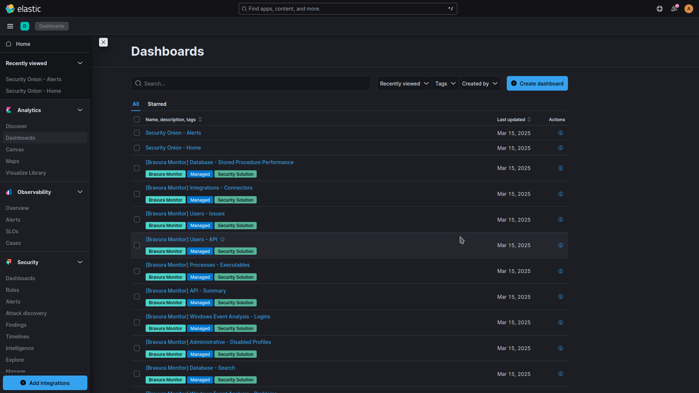
Incluye un conjunto de paneles que proporcionan un conjunto de informacion no tan completa como la de los **Dashboard** del **SOC**.

:::tip[Punto de inicio]
Se debería de empezar en el dashboard **Security Onion - Home**
:::

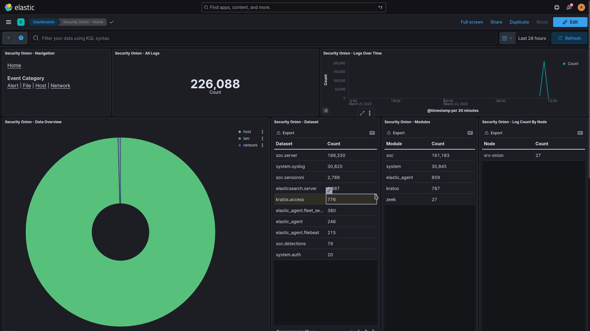

A veces puede haber algún problema con los paneles y se puede requerir restaurarlos, para ello ejecutar el siguiente comando.
```
sudo so-kibana-config-load
```
Si la solución anterior no funciona entonces habrá que ejecutar la siguiente
```
sudo salt-call state.apply kibana.so_savedobjects_defaults -l info queue=True
```
:::tip[Kibana Spaces]
<a href="https://www.elastic.co/guide/en/kibana/current/xpack-spaces.html"> + Información sobre los espacios de Kibana</a>
:::

### Elastic Fleet :battery:
Este servicio está preconfigurado durante la configuración de SOC, si se necesita realizar algún cambio se puede llevar a cabo desde **Elastic Kibana**.

Para consultar los agentes hacer click en el **nombre del Host**. Entonces se verán los **detalles** del **agente** *(información e integraciones)*, los **logs** y **diagnósticos**.

Cada agente dispone de unas **Políticas de Agente** que estructuran los tipos de datos que ingerirá cada agente y que se enviarán a **Elasticsearch** mediante HTTP o TCP. Los **componentes** dentro de cada política de agente se llaman **integraciones**.

### Osquery Manager :beginner:
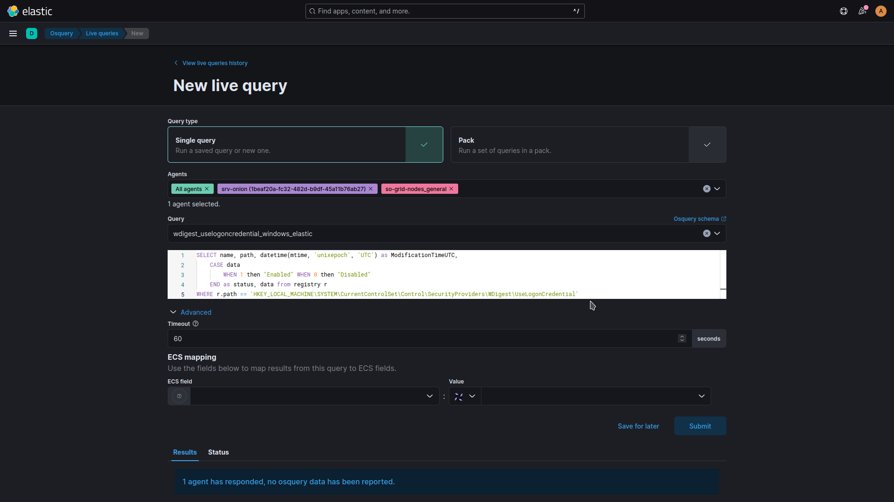
Permite ejecutar consultas al historial mediante sentencias SQL, además de permitir almacenar queries recurrentes.

:::tip[+ Información]
- <a href="https://www.elastic.co/guide/en/integrations/current/osquery_manager.html">+ información sobre Osquery Manager</a>
:::

### InfluxDB
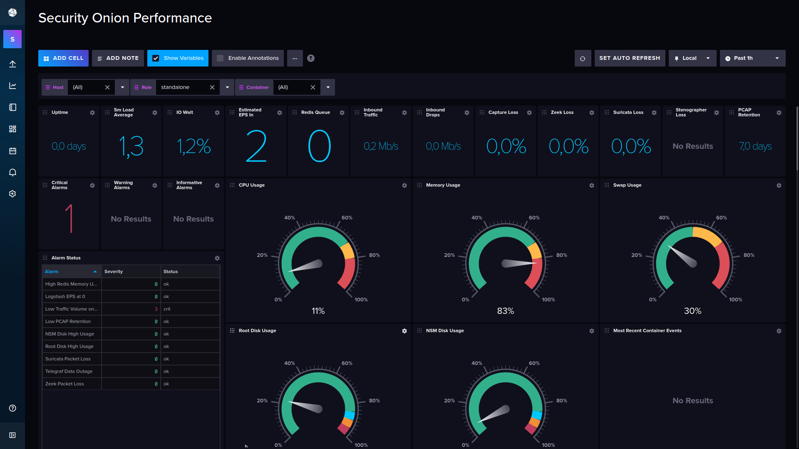
**InfluxDB** es un sistema **gestor de bases de datos temporales** de código abierto, incluye una ***API** para poder trabajar con los datos o para otros fines como monitorización o alertas.


El acceso se lleva a cabo con las credenciales de SecurityOnion, si surge algún problema con las credenciales se puede solucionar desde la interfaz de la sección de **Administration**.

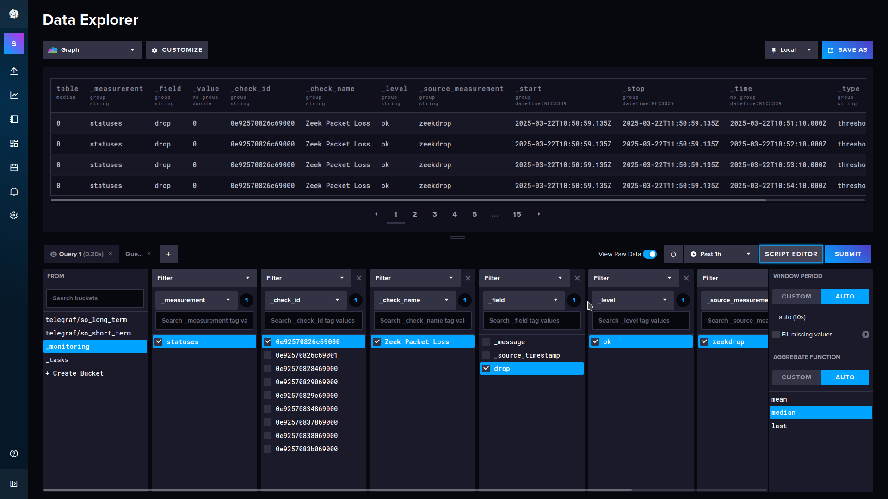

Los datos almacenados llevan incorporado una **marca de tiempo** y además permite trabajar con varios origenes de datos diferentes, entre ellos los **buckets**.


:::tip[Repositorio InfluxDB]
- <a href="https://github.com/influxdata/influxdb">Ir al repositorio</a>
:::

Para configurar **InfluxDB** se puede llevar a cabo a través de **Administration** -> **Configuration** -> **InfluxDB**. Para configurar **Telefraf** ir también a su correspondiente sección dentro de **Configuration**.

### CyberChef :pill:
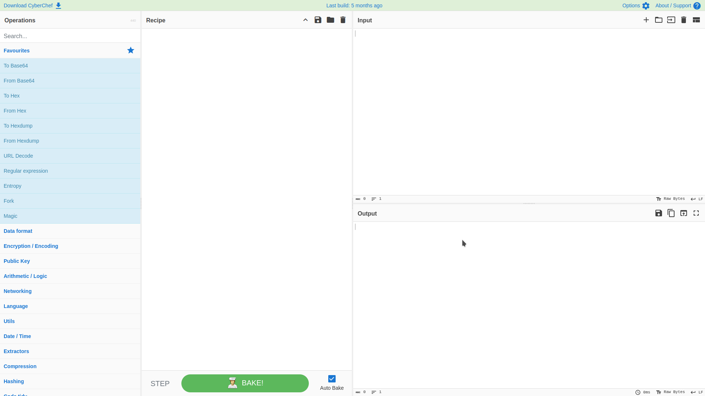
Permite disponer de una consola en el navegador web para poder llevar a cabo cierto tipo de operaciones como codificaciones simples tipo Base64, cifrados complejos como AES, DES o Blowfish, crear binarios y hexdumps, compresión y descompresión de datos, análisis IPv6 y X.509, etc...

#### Áreas
1. Cuadro de entrada de datos en la parte superior derecha de la interfaz de usuario.
2. Caja de salida de datos en la parte inferior derecha de la interfaz de usuario.
3. Lista de operaciones en la esquina izquierda lateral.
4. Área **Recipe** en la columna del medio, donde se debe de arrastrar las operaciones que se quieren realizar y configurar las opciones requeridas.


:::tip[Repositorio]
- <a href="https://github.com/gchq/CyberChef">GitHub</a>
:::

### ATT&CK Navigator :cloud:
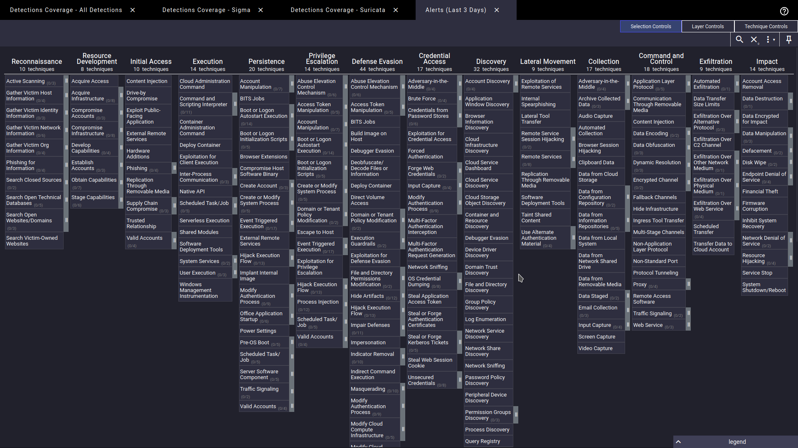
Es un navegador que proporciona una navegación básica y anotación de matrices ATT&CK. Permite manipular las células de la matriz con el color, añadir comentarios, frecuencia de técnicas detectadas... es simplemente una herramienta sencilla para poder visualizar las incidencias.

También permite generar capas para definir vistas. La configuración de navigator es accesible desde **/opt/so/conf/navigator**, aunque la misma se realiza con **Salt** entonces si se realiza alguna modificación en la ruta anterior será sobreescrita por **Salt*+.

:::tip[Repositorio]
- <a href="https://github.com/mitre-attack/attack-navigator">GitHub</a>
:::


