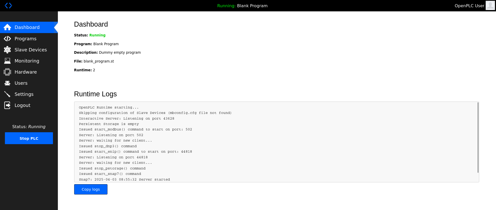
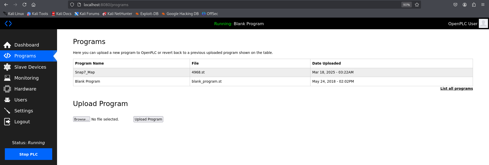

# Open PLC
Es una plataforma de automatización industrial **Open Source** que permite programar PLCs. 
<details>
<summary>
Características principales
</summary>

- Compatibilidad con estándares **IEC 61131-3**
- Soporta lenguajes de programación de PLC:
```
1. Ladder Diagram (LD)
2. Function Block Diagram (FDB)
3. Structured Text (ST)
4. Seguential Function Chart (SFC)
```
- Multiplataforma
- Hardware base:
```
1. Ordenadores (Pc, Raspberry Pi...)
2. Microcontroladores (Arduino, ESP32...)
3. PLCs industriales compatibles
```
- HMI/SCADA: permite crear interfaces de supervisión y control.

</details>

:::tip[Información Web]
- <a href="https://openplcproject.com/">Web Oficial</a>
- <a href="https://github.com/thiagoralves/OpenPLC_v3">GitHub</a>
:::


### Pasos previos instalación
#### Actualizar el sistema operativo
```
sudo apt update && sudo apt upgrade -y
```
#### Dependencias necesarias
```
sudo apt install -y git build-essential pkg-config automake libtool cmake python3 python3-pip \
libssl-dev libmodbus-dev libpthread-stubs0-dev python2.7-dev python3-dev
```
#### NodeJS
Necesario para la parte de la interfaz web
```
curl -fsSL https://deb.nodesource.com/setup_lts.x | sudo -E bash -
sudo apt install -y nodejs
```
#### Clonar repositorio
```
git clone --recursive https://github.com/thiagoralves/OpenPLC_v3.git
```
### Instalar OpenPLC
Acceder a OpenPLC_v3
```
cd OpenPLC_v3
```
Lanzamiento de la instalación
```
./install.sh
```
La instalación permite varias opciones depende del entorno donde vaya a operar.
```
./install.sh linux
```
### Inicializar el PLC
```
./start_openplc.sh
```
#### Acceso web
El **PLC** tiene una interfaz de operativilidad accesible en el puerto **8080**.


```
http://localhost:8080
```
#### Login
Las credenciales de acceso por defecto en OpenPLC son las siguientes.
```
openplc/openplc
```
### Varias imágenes en funcionamiento

#### Sección Dashboard


#### Sección Programs



